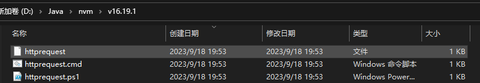

# HTTPREQUEST-CLI

A CLI tool for XDU work on How to use asynchronous programming techniques.

# Installation

Clone the repository:

> git clone https://github.com/22510/HTTPREQUEST-CLI.git

Install the dependencies:

> npm i

Install the package globally on your machine: (If you don't, you won't be able to use it on the command line)

> npm i -g

# Usage

1.  Send a GET request to a URL to get the web page content:

> httprequest get <url>

For example:

> httprequest get http://39.101.74.9:8090

> httprequest get https://github.com

2.  Display previously visited urls:

> httprequest list

Connections that have been successfully accessed and timed out are displayed.

# Some information

1.  Data storage location:

I use the open source **conf** package for data saving.

You can modify the storage address in `commands/httprequest.js`. Please see the code comments for details.

2.  Access timeout setting:

Also in the commands/httprequest.js file, just modify the `timeoutThreshold` variable.

3. npm i -g will add some content to your node .js, and you can remove them to avoid affecting your command line.

Since I use NVM for node .js management, you can find your node .js path yourself under this path

# Thank

These projects have helped me a lot:

1.  [shahednasser/todos-cli --- Shahednasser/All-CLI (github.com)](https://github.com/shahednasser/todos-cli)
2.  https://github.com/sindresorhus/conf
3.  https://github.com/tj/commander.js
4.  https://github.com/sindresorhus/conf
